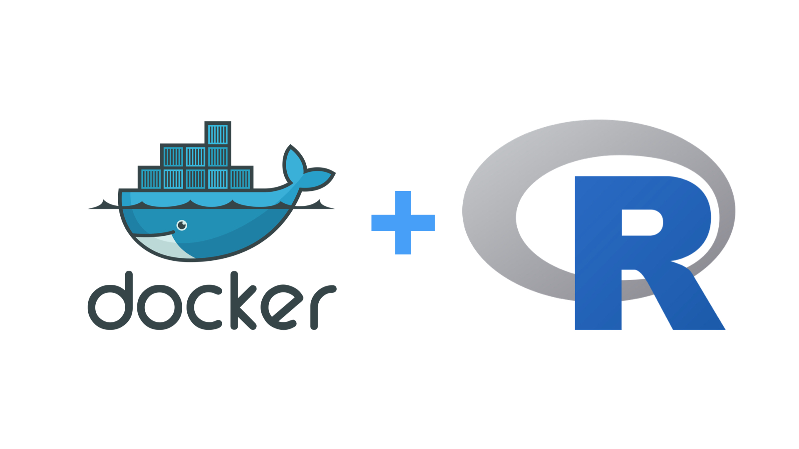

# useR 2022 Docker for R Users Workshop

Materials for **Docker for R Users** workshop at the useR 2022 conference. 

**Time:** Monday, 20 June 2022, 4:00 - 7:30am CDT

**More info:** https://user2022.r-project.org/program/tutorials/#docker-for-r-users

### Agenda

* Kick Off [20 min] : 2:00 - 2:20
    * About Us
    * Polls
    * Code of Conduct
    * Engagement Model
    * GitHub Repo
    * Brief Installation & Testing Review
* Introduction to Docker [30 min] : 2:20 - 2:50 
    * Motivation For Docker
    * Example Usecases
    * What is Docker?
    * Docker Workflow
* Q & A [10 min] : 2:50 - 3:00
* Break [5 min] : 3:00 - 3:05
* Dockerfile [30 min] : 3:05 - 3:35
   * Overview
   * Core commands
   * Image Layers
   * Q & A
* Docker CLI [25 min] : 3:35 - 4:00
  * docker commands
  * docker-compose commands
  * Q & A
* Break [10 min] : 4:00 - 4:10
* Docker + R Basics [45 min] : 4:10 - 4:55
   * Introduction to Rocker
   * Installing packages
   * Develop in Docker
   * Deploy Models in Docker
   * Deploy Shiny in Docker
* Intermediate Concepts [20 min] : 4:55 - 5:15
   * Package Development with GitHub Actions [15 min]
   * VS Code, R and Docker [10 min]
   * _Stretch Goal - Postgres & R_
* Summary and Q & A [15 mins] : 5:15 - 5:30
